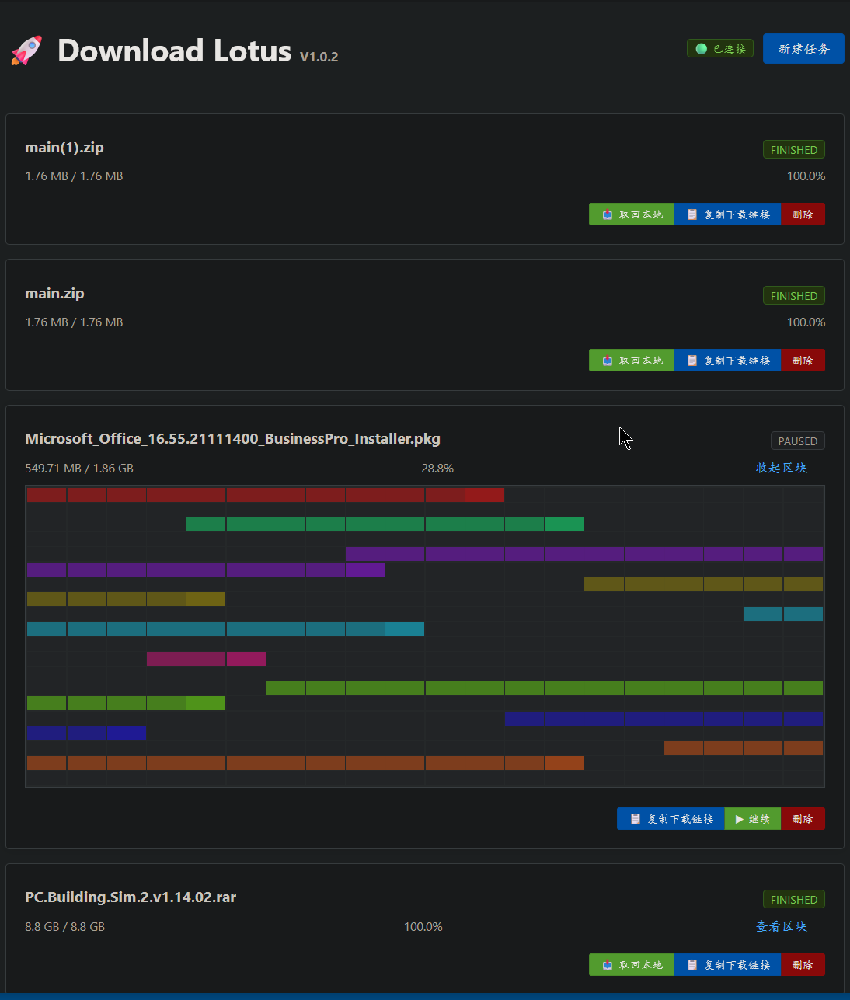

# 🚀 Download Lotus - 高性能多线程下载器

<p align="center">
  
  
  
</p>



Download Lotus 是一个基于 Spring Boot 开发的高性能多线程文件下载器，采用 Fork/Join 架构实现动态任务分配和断点续传功能。

## ✨ 核心特性

- **多线程并行下载**：支持多线程并发下载，显著提升下载速度
- **Fork/Join 架构**：使用 ForkJoinPool 实现动态任务分配和 Work Stealing
- **动态 Range 重分配**：当线程速度过低时自动重新分配下载范围（未完成线程 ≤ 3，速度 < 20%）
- **断点续传**：支持暂停后继续下载，无需重新开始
- **实时进度监控**：WebSocket 实时推送每个线程的下载速度和进度
- **错误重试机制**：每个线程出错后可自动重试（最多 5 次）
- **前后端分离**：前端采用 Vue 3 + Element Plus 实现友好的用户界面
- **持久化存储**：使用 SQLite 数据库记录下载任务信息

## 🏗️ 技术栈

### 后端
- **JDK 1.8**
- **Spring Boot 2.7.14** - Web、WebSocket、JPA
- **Apache HttpClient 4.5.14** - HTTP 下载客户端
- **SQLite** - 轻量级数据库
- **Lombok** - 简化代码
- **FastJSON** - JSON 序列化

### 前端
- **Vue 3** - 渐进式 JavaScript 框架
- **Element Plus** - Vue 3 UI 组件库
- **SockJS + STOMP** - WebSocket 客户端

## 🚀 快速开始

### 前置要求

- JDK 1.8 或更高版本
- Maven 3.6+
- （可选）Docker

### 本地部署

#### 方式一：使用 Maven

1. **克隆项目**
```bash
git clone https://github.com/shnulaa/download_lotus.git
cd download_lotus
```

2. **编译打包**
```bash
mvn clean package
```

3. **运行应用**
```bash
java -jar target/downloader-1.0.0.jar
```

4. **访问应用**
打开浏览器访问：http://localhost:8080

#### 方式二：使用 Docker

1. **构建 Docker 镜像**
```bash
docker build -t download-lotus:1.0.0 .
```

2. **运行容器**
```bash
docker run -d \
  --name download-lotus \
  -p 8080:8080 \
  -v /path/to/downloads:/app/downloads \
  download-lotus:1.0.0
```

将 `/path/to/downloads` 替换为你本地下载目录的绝对路径

#### 方式三：开发模式

1. **导入项目到 IDE**
   - IntelliJ IDEA 或 Eclipse
   - 作为 Maven 项目导入

2. **运行主类**
   - 主类：`com.example.downloader.DownloaderApplication`

3. **访问前端**
   - 应用内置了前端页面，访问：http://localhost:8080

## 📖 使用说明

### 下载文件

1. 在"下载地址"输入框中输入文件的 HTTP/HTTPS 下载链接
2. 在"保存路径"输入框中输入本地保存目录路径（如 `./downloads/`）
3. 点击"开始下载"按钮

### 控制下载

- **暂停**：点击"暂停"按钮可以暂停当前下载任务，下载进度会保存
- **继续**：暂停后再次点击"开始下载"可以继续下载（断点续传）
- **取消**：点击"取消"按钮会取消下载并删除已下载的文件

### 查看进度

- **总进度条**：显示整体下载进度
- **线程详情**：实时显示每个线程的下载范围、速度、进度和状态
- **速度监控**：每个线程的实时下载速度会每秒更新

### 动态 Range 重分配

当满足以下条件时，系统会自动触发 Range 重分配：
- 未完成下载的线程数量 ≤ 3 个
- 某个线程的下载速度 < 当前最大速度的 20%

系统会将慢速线程的剩余下载范围切分为两部分，分配给两个线程并行下载，解决"长尾效应"。

## 🏛️ 架构设计

### 核心组件

1. **DownloadTaskContext** - 下载任务上下文
   - 管理单个文件的所有分片任务
   - 处理状态流转（下载中、暂停、取消、完成）
   - 实现动态任务重分配逻辑

2. **ChunkInfo** - 分片信息
   - 记录每个线程的下载范围（start, end）
   - 记录当前进度（current）和速度（speed）
   - 记录错误次数和完成状态

3. **ChunkWorker** (ForkJoin Worker)
   - 实际执行下载任务的工作线程
   - 支持错误重试和暂停/取消
   - 使用 HTTP Range 请求下载指定范围

4. **DownloadController** - 下载控制器
   - 提供 RESTful API 控制下载
   - 使用 WebSocket 推送实时进度

### 工作流程

```
用户请求下载
    ↓
初始化文件（创建空文件、获取文件大小）
    ↓
切分下载范围（初始5个线程）
    ↓
提交 ForkJoin Worker 执行任务
    ↓
监控线程每秒统计速度和进度
    ↓
判断是否需要动态重分配
    ↓
所有线程完成后，任务结束
```

## 🔧 配置说明

### 应用配置

配置文件：`src/main/resources/application.yml`

```yaml
server:
  port: 8080

spring:
  datasource:
    url: jdbc:sqlite:downloader.db
    driver-class-name: org.sqlite.JDBC
  jpa:
    hibernate:
      ddl-auto: update
    show-sql: false
    database-platform: com.example.downloader.config.SQLiteDialect
```

### ForkJoinPool 配置

在 `DownloadTaskContext.java` 中可以配置线程池参数：

```java
// 并行度设为 32，避免 IO 阻塞导致线程耗尽
this.chunkExecutor = new ForkJoinPool(32);
```

## 📊 性能优化

### 线程池大小
- 默认设置为 32，适用于大多数场景
- 可根据服务器 CPU 核数和带宽进行调整

### 缓冲区大小
- 默认缓冲区大小为 8KB
- 可以根据网络环境调整：
```java
byte[] buffer = new byte[8192];  // 可调整为 16KB 或 32KB
```

### 动态分配阈值
- 速度阈值：最大速度的 20%
- 剩余线程数：≤ 3 个
- 最小切分大小：1MB

## 🤝 贡献

欢迎提交 Issue 和 Pull Request！

## 📄 许可证

本项目采用 MIT 许可证 - 查看 [LICENSE](LICENSE) 文件了解详情

## 🙏 致谢

- [Spring Boot](https://spring.io/projects/spring-boot)
- [Vue.js](https://vuejs.org/)
- [Element Plus](https://element-plus.org/)
- [Apache HttpClient](https://hc.apache.org/)

## 📞 支持

如有问题或建议，请通过 [GitHub Issues](https://github.com/shnulaa/download_lotus/issues) 联系我们。
